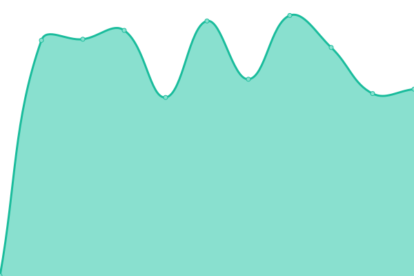
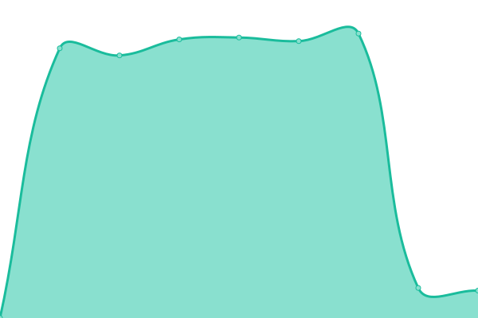

# [📈 Live Status](https://ershaaa.github.io/status-page): <!--live status--> **🟩 All systems operational**

This repository contains the open-source uptime monitor and status page for [ershaaa](https://ershaaa.github.io/status-page), powered by [Upptime](https://github.com/upptime/upptime).

With [Upptime](https://upptime.js.org), you can get your own unlimited and free uptime monitor and status page, powered entirely by a GitHub repository. We use [Issues](https://github.com/ershaaa/status-page/issues) as incident reports, [Actions](https://github.com/ershaaa/status-page/actions) as uptime monitors, and [Pages](https://ershaaa.github.io/status-page) for the status page.

<!--start: status pages-->
<!-- This summary is generated by Upptime (https://github.com/upptime/upptime) -->
<!-- Do not edit this manually, your changes will be overwritten -->
<!-- prettier-ignore -->
| URL | Status | History | Response Time | Uptime |
| --- | ------ | ------- | ------------- | ------ |
|  [API Health](https://api.adanothe.com/healthz) | 🟩 Up | [api-health.yml](https://github.com/ershaaa/status-page/commits/HEAD/history/api-health.yml) | 

 734ms
     
 | 

<a href="https://ershaaa.github.io/status-page/history/api-health">100.00%</a>
    

|  [Explorer Mainnet](https://explorer.adanothe.com/) | 🟩 Up | [explorer-mainnet.yml](https://github.com/ershaaa/status-page/commits/HEAD/history/explorer-mainnet.yml) | 

 3870ms
     
 | 

<a href="https://ershaaa.github.io/status-page/history/explorer-mainnet">100.00%</a>
    

|  [Explorer Testnet](https://Bakerloo.adanothe.com/) | 🟩 Up | [explorer-testnet.yml](https://github.com/ershaaa/status-page/commits/HEAD/history/explorer-testnet.yml) | 

 3897ms
     
 | 

<a href="https://ershaaa.github.io/status-page/history/explorer-testnet">100.00%</a>
    

<!--end: status pages-->

[**Visit our status website →**](https://ershaaa.github.io/status-page)

## 📄 License

- Powered by: [Upptime](https://github.com/upptime/upptime)
- Code: [MIT](./LICENSE) © [Anand Chowdhary](https://anandchowdhary.com), supported by [Pabio](https://pabio.com)
- Data in the `./history` directory: [Open Database License](https://opendatacommons.org/licenses/odbl/1-0/)
